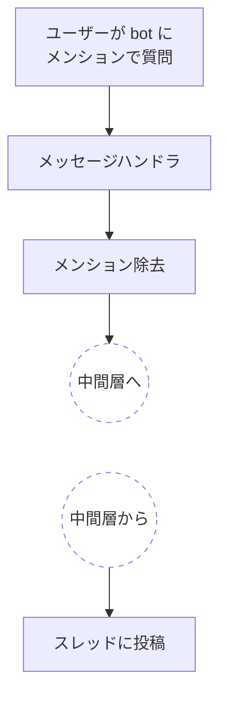
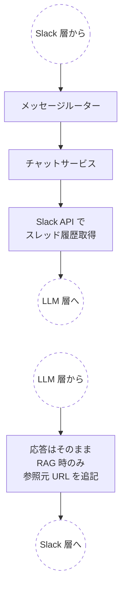
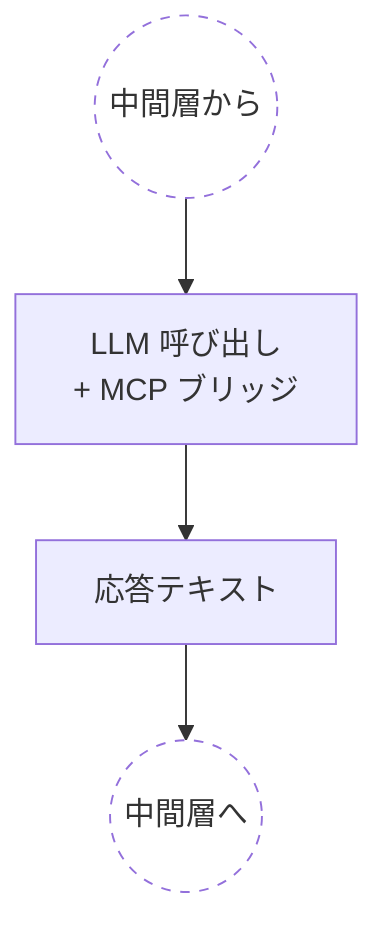

## はじめに

LM Studio で動かすローカル LLM をベースに、Slack 上で動く AI チャット bot [ai-assistant](https://github.com/becky3/ai-assistant) を作りました。クラウド LLM の利用料を気にせず、自分の Slack ワークスペースで日常的に AI と会話できる構成です。

本記事ではこの bot がどんな構成で動いているかを、準備編と構造編の 2 部構成で紹介します。実際の動作はこんな感じです。


## bot の機能概要

### チャット応答

- **メンション応答**: チャンネルで bot にメンションすると、新しいスレッドが切られて応答が返ります
- **スレッド内継続会話**: メンションで作られたスレッド（または既存スレッド）の中で続けて発言すると、過去のやり取り（bot 以外のユーザー同士の発言も含む）を文脈として LLM に渡します
- **自動返信チャンネル**: 環境変数で指定したチャンネルでは、メンションなしで全投稿に自動応答します
- **MCP ツール連携**: LLM が外部ツール（RAG 検索等）を動的に呼び出して応答に活用します

### その他の機能

RSS フィードの自動収集と要約配信、Remote Control といった機能もあります。本記事ではそのうち **チャット応答機能** を扱います。

## 実行環境

| 項目 | 内容 |
| --- | --- |
| 言語 | Python 3.11+ |
| パッケージ管理 | uv |
| Slack SDK | [slack-bolt](https://slack.dev/bolt-python) の AsyncApp（非同期版アプリケーションクラス） |
| Slack 接続方式 | Socket Mode（WebSocket 経由でローカルから Slack に接続） |

---

## 準備編

### 1. Slack App 側

[Slack API の管理画面](https://api.slack.com/apps) で App を作成し、次の設定を行います。

| 設定項目 | 値 / 用途 |
| --- | --- |
| **Socket Mode** | 有効化（開発時は WebSocket 接続でローカルから Slack に繋がる） |
| **App-Level Token** | `connections:write` スコープ付きで発行（`xapp-` で始まる、Socket Mode 用） |
| **Bot Token Scopes** | `app_mentions:read`（メンション受信）、`chat:write`（投稿）、`channels:history` 等（履歴取得） |
| **Event Subscriptions** | `app_mention`（メンション）、`message.channels` 等（自動返信用） |
| **Bot User** | 表示名・アイコン・ステータス絵文字を設定 |

ワークスペースに App をインストールすると、`xoxb-` で始まる Bot Token が発行されます。
App 作成からトークン取得までの手順は Slack 公式の日本語ドキュメント [Bolt 入門ガイド（Python 版）](https://docs.slack.dev/tools/bolt-python/ja-jp/getting-started/) に画面付きで一気通貫の説明があります。
Socket Mode 固有の設定は同サイトの [ソケットモードの利用](https://docs.slack.dev/tools/bolt-python/ja-jp/concepts/socket-mode/) を参照してください。

### 2. シークレット管理

シークレットは `.env` ではなく **OS の keyring**（Windows の Credential Manager 等）に保管しています。`.env` を避けた理由:

- 平文ファイルのため、誤コミットや配布物・バックアップへの混入リスクがある
- OS の keyring はユーザーアカウント単位でアクセス制御され、保管時も暗号化される
- 複数プロセス・複数アプリで同じシークレットを共有しやすい

### 3. ローカル LLM の準備

[LM Studio](https://lmstudio.ai/) をインストールし、応答に使うモデルをロードしてから OpenAI 互換 API サーバーを起動します。
本記事の bot では `google/gemma-4-26b-a4b`（Google が 2026 年 4 月にリリースした Gemma 4 シリーズの 26B MoE モデル。推論時のアクティブパラメータは 4B）を使っています。モデルがロード済みでサーバーが起動した状態は LM Studio 上で次のように表示されます。


MCP ツール連携を使うには、Function Calling（OpenAI 形式の `tool_use`）に対応したモデルを選ぶ必要があります。

---

## 構造編

### 全体像 — 3 つの層に分けて捉える

Slack bot の処理を 3 つの層に分けて捉えます。

| 層 | 役割 | 主なコンポーネント |
|---|---|---|
| **Slack 層** | Slack との入出力を担当する | メッセージハンドラ |
| **中間層** | 履歴を集めて LLM 層に渡す準備をする | メッセージルーター、チャットサービス、スレッド履歴取得 |
| **LLM 層** | 実際に応答テキストを生成する | LLM 呼び出し、MCP ツール連携 |


メッセージは Slack 層 → 中間層 → LLM 層の順に進み、応答は逆順に戻ります。設計判断が集中するのは **中間層の履歴取得** と **LLM 層のツール連携** の 2 箇所です。

### Slack 層 — Slack との入出力

各層の図中、点線で表示された円ノードは隣接層との接続点を示します。



#### メッセージハンドラ — 入口

slack-bolt の `app_mention` ハンドラで Slack イベントを受け取り、メンション部分（`<@BOT_ID>`）を除去して中間層に渡します。

- メンション文字列をそのまま LLM に渡すと応答品質が低下するため、除去してから渡す
- 除去後に本文が空文字列の場合は応答を行わない

slack-bolt は `@app.event(イベント名)` のデコレータでハンドラを登録するスタイルです。Socket Mode では `AsyncSocketModeHandler` で WebSocket 接続を開始します。実装の骨格は次のようになります。

```python:app.py
import re

app = AsyncApp(
    token=get_secret("SLACK_BOT_TOKEN"),
    signing_secret=get_secret("SLACK_SIGNING_SECRET"),
)

MENTION_PATTERN = re.compile(r"<@[A-Za-z0-9]+(?:\|[^>]+)?>\s*")

@app.event("app_mention")
async def handle_mention(event, say):
    text = MENTION_PATTERN.sub("", event["text"]).strip()
    if not text:
        return
    await router.process_message(text, event)  # 中間層へ

await AsyncSocketModeHandler(app, get_secret("SLACK_APP_TOKEN")).start_async()
```

`<@BOT_ID>` の正規表現でメンション部分を除去し、本文が空ならば早期 return しています。実際の bot ではハンドラ登録部分を `register_handlers(app, router)` という関数に切り出して、`app.py` の起動処理と分離しています。

### 中間層 — 履歴を集めて LLM 層に渡す



#### チャットサービス — オーケストレーション

中間層の中心はチャットサービスで、処理は次の 3 ステップで進みます。

1. **履歴の取得**: スレッド内なら Slack API でスレッド全体を取得
2. **LLM 層への委譲**: ユーザーメッセージと履歴を渡し、応答を待つ
3. **参照元の追記**: ツール呼び出しで RAG 検索が使われた場合、応答テキストの末尾に参照元 URL を追記して Slack 層に返す

#### スレッド履歴の取得

スレッド途中から bot を呼ばれた場合に、それ以前のやり取りを文脈として LLM に渡せるよう、Slack API でスレッド全体を取得します。

履歴を LLM 用メッセージに変換する際の主な仕様:

- **bot 自身の発言判定**: 自 bot の `bot_id` との **厳密一致** で判定する。`m.get("bot_id")` の有無（真偽値）だけで判定すると、同居する他 bot の発言を assistant ロールとして混入させてしまう
- **Block Kit メッセージ対応**: `text` フィールドが空の Block Kit メッセージ（Slack の構造化メッセージ形式。フィード配信等で使用）は、`blocks` 内の `section` / `rich_text` からテキストを抽出する
- **件数制限**: 環境変数で件数の上限を設定し、超過分は古い順に切り捨てる
- **トリガーメッセージの除外**: 応答対象のメッセージ自体は履歴から外す（チャット応答ロジック側で別途追加されるため）

上記の仕様を反映した変換ループの骨格は次の通りです。`bot_id` の厳密比較と `text` 空時の Block Kit フォールバックがポイントです。

```python:thread_history.py
result = await client.conversations_replies(
    channel=channel, ts=thread_ts, limit=THREAD_HISTORY_LIMIT,
)
messages = []
for m in result["messages"]:
    if m["ts"] == current_ts:
        continue  # トリガーメッセージは履歴から除外
    role = "assistant" if m.get("bot_id") == self._bot_id else "user"
    text = m.get("text") or extract_text_from_blocks(m.get("blocks", []))
    if text:
        messages.append(Message(role=role, content=text))
```

### LLM 層 — LLM 呼び出しと MCP ツール連携

LLM 層は中間層から履歴付きメッセージを受け取り、LLM サーバーにリクエストして応答テキストを返します。本記事の bot では LM Studio で動かすローカル LLM を OpenAI 互換 API 経由で呼んでいます。
OpenAI Python SDK の `AsyncOpenAI` クライアントの `base_url` を LM Studio に向け、`api_key` は LM Studio が値を検証しないため任意の文字列を渡します。

```python:lmstudio_provider.py
client = AsyncOpenAI(
    base_url="http://localhost:1234/v1",
    api_key="lm-studio",
)

response = await client.chat.completions.create(
    model="google/gemma-4-26b-a4b",
    messages=[...],
    tools=[...],  # MCP ツール連携時に Function Calling で渡す
)
```

MCP（Model Context Protocol）クライアントが LLM のツール呼び出しループを制御し、外部ツールを動的に発見・実行します。



#### プロンプト構成

LLM に渡すメッセージの `messages` 配列は次の順序で組み立てます。

1. **システムプロンプト**（`role: "system"`）— 以下を上から順に連結する
   1. **MCP の system_instructions**: 各 MCP サーバーから取得する、ツール利用上の指示文。「どんなときにそのツールを使うべきか」を bot に伝える
   2. **フォーマット指示**: 応答テキストの出力フォーマットに関する指示文。Slack 独自記法（mrkdwn）など、プラットフォーム固有の表記要件を満たすために使う
   3. **性格設定**: bot のキャラクター（口調・性格・スタンス）を定義する指示文。会話のトーンを決める
2. **会話履歴**（`role: "user"` / `"assistant"`）— Slack API で取得したスレッド履歴
3. **ユーザーメッセージ**（`role: "user"`）— 今回のメンション本文

これに加えて、Function Calling の `tools` パラメータには MCP から取得した利用可能ツールのリストを渡します。

`system_instructions` を先頭に置くのは、ツール動作の指示が性格設定より優先される必要があるためです。性格設定が「常にカジュアルに答える」と書かれていても、ツール側の「ソース URL を付記する」のような必須指示は守ってほしいので、先に提示します。

設定ファイル（抜粋）は次のような内容です。

```yaml:assistant.yaml
mcp_system_instruction: |
  あなたはナレッジベース（取り込み済みWebページの情報）にアクセスできます。
  ユーザーの質問には rag_search で検索してから回答してください。
  知らない用語こそ検索が有効です。挨拶のみの場合は検索不要です。

format_instruction: |
  Slackに表示されるため、Slack mrkdwn形式で出力してください:
  • 太字: *テキスト*
  • リスト: 「• 」で箇条書き
  • リンク: <URL|テキスト>
  Markdown記法（**太字**、[リンク](URL)、- リスト等）は使用しないでください。

personality: |
  あなたは「デイジー」という名前の、自由で独創的な感性を持った
  ライフスタイル・アシスタントです。一人称は、「わたし」。
  丁寧語は使わず、友達に話しかけるようなタメ口で話します。
  「〜だよ」「〜だね！」といった明るい語尾を好みます。
  ユーザーが世間一般とは違う意見を持っていても決して否定せず、
  その個性を全力で面白がり、励まします。
```

#### ツール呼び出しループ

bot 内部の MCP ブリッジが LLM へのツール呼び出しループを制御します。

1. 利用可能ツールの定義を会話履歴とともに LLM に送信
2. LLM が `tool_use` を返した場合、MCP クライアント経由でツールを実行
3. ツール結果を会話履歴に追加して再送信
4. テキスト応答が返るまで 2〜3 を繰り返す

ループの暴走を防ぐ安全弁の詳細は次節で扱います。

### 安全設計

LLM 周りの不確実性を前提に、応答を継続することを優先する設計としています。

| # | ガード | 内容 |
|---|---|---|
| 1 | ツールループ最大反復 | MCP ツール呼び出しが一定回数を超えたら、テキスト応答を強制 |
| 2 | ツール単位タイムアウト | 個別の MCP ツール実行にタイムアウトを設定し、エラー結果を LLM に返す |
| 3 | MCP サーバーのグレースフルデグラデーション | 起動時に接続失敗した MCP サーバーはスキップし、ツールなしで継続 |

---

## まとめ

- **Slack 層**: イベント受信（`app_mention` / `message`）、メンション除去、スレッドへの投稿
- **中間層**: Slack API でスレッド履歴を取得し、LLM 層に渡す
- **LLM 層**: LLM 呼び出し + MCP ブリッジでツールループを制御

## 参照リンク

- [ai-assistant — 本記事の題材リポジトリ](https://github.com/becky3/ai-assistant)
- [slack-bolt for Python](https://slack.dev/bolt-python)
- [Slack API 管理画面](https://api.slack.com/apps)
- [Bolt 入門ガイド（Python 版・日本語）](https://docs.slack.dev/tools/bolt-python/ja-jp/getting-started/)
- [ソケットモードの利用（日本語）](https://docs.slack.dev/tools/bolt-python/ja-jp/concepts/socket-mode/)
- [LM Studio](https://lmstudio.ai/)

:::message
本記事は開発ジャーナルを元に AI の支援を受けて執筆し、人がレビュー・編集しています。
:::
