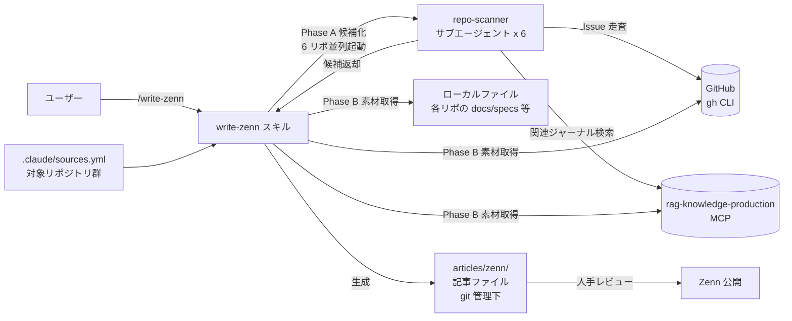

# 技術記事生成

## 概要

開発知見（ジャーナル / GitHub Issue / 仕様書 / コード）を素材として、技術記事ドラフトを Claude Code スキル経由で生成する機能。

プラットフォームごとに独立したスキルを提供する。現時点では Zenn 向けの `/write-zenn` のみを提供する。

## 背景

開発の中で得られた学び・判断・気づきは、ジャーナルやドキュメントに散在する。これらを技術記事として外部に公開するには、素材の収集・記事タイプの判断・プラットフォーム固有のフォーマット適用といった作業が必要になる。本機能は、これらを Claude Code スキルとして自動化し、執筆者がレビュー・調整に集中できるようにする。

プラットフォームごとに必要なフロントマター・記法・トーンが異なるため、共通レイヤーで抽象化するのではなく、プラットフォーム別の独立スキルとして実装する方針を採る。スキル間でロジックが重複しても、各プラットフォームの特性に合わせた表現を独立に最適化できるメリットを優先する。

## 制約

- 生成される記事ドラフトは `published: false` 等のプラットフォーム既定の非公開状態とする。公開判断は人間が行う
- 生成された記事は必ずレビューしてから公開する（事実確認・推敲・正直さの観点）
- 出力先は `articles/{platform}/{YYYYMMDD-HHMMSS}-{article-slug}.md` とし、git 管理下に置く（記事の経緯と差分を git で追跡可能にする）
- `{platform}` の命名はスキル名 `/write-{platform}` の `{platform}` 部分と一致させる。SSoT は各スキル SKILL.md
- 著作物・実在する個人/作品由来の固有名詞・特徴的言い回しを記事本文に混入しない（`~/.claude/rules/invariants.md` 準拠）
- 素材源として参照する対象リポジトリは `.claude/sources.yml` で一元管理する。各リポのローカルパスは環境変数 `LOCAL_REPOS_ROOT` を起点に `${LOCAL_REPOS_ROOT}/<owner>/<name>` で解決する
- トピック候補化（Phase A）はリポジトリ単位のサブエージェント（`repo-scanner`）を並列起動して候補を集約する。対象リポは「固定 3 リポ + ランダム 3 リポ」の合計 6 リポを毎回選定する（活動量の多いリポを継続的にカバーしつつ、他リポも探索対象に含める意図）

## 操作一覧

| 操作 | トリガー | 概要 |
|---|---|---|
| `/write-zenn` | Claude Code セッション内のスラッシュコマンド | Zenn 形式の技術記事ドラフトを生成する |

## 各操作の仕様

### `/write-zenn`

Zenn 形式の技術記事ドラフトを生成するスキル。

- **トリガー**: Claude Code セッション内で `/write-zenn` をスラッシュコマンドとして実行
- **入力**: 引数なし（トピック候補から選択）または `<テーマ>`（自由文での直接指定）
- **素材**: `.claude/sources.yml` に記載された対象リポジトリ群を横断する。素材源はジャーナル（RAG 経由）・GitHub Issue（`gh` CLI）・各リポの `docs/specs/` 配下・関連コード
- **出力**: `articles/zenn/{YYYYMMDD-HHMMSS}-{article-slug}.md`
- **公開後の追記**: 記事公開（fix）後にユーザー指示を受けたタイミングで、`articles/zenn/published.txt` に記事化履歴を追記する
- **動作仕様の詳細**（処理手順・記事タイプ判定ロジック・テンプレート・品質ガイドライン）: `.claude/skills/write-zenn/SKILL.md` および同階層の関連ファイルに保持する

## コンポーネント構成

## 関連ドキュメント

- `.claude/skills/write-zenn/SKILL.md`: `/write-zenn` スキル本体（動作仕様）
- `.claude/skills/write-zenn/quality-guidelines.md`: 執筆品質ガイドライン
- `.claude/skills/write-zenn/template-*.md`: 記事タイプ別テンプレート
- `.claude/agents/repo-scanner.md`: Phase A の候補抽出を担当するサブエージェント定義
- `.claude/sources.yml`: 素材源として参照する対象リポジトリ一覧
